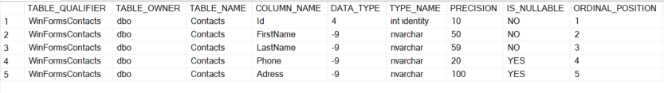
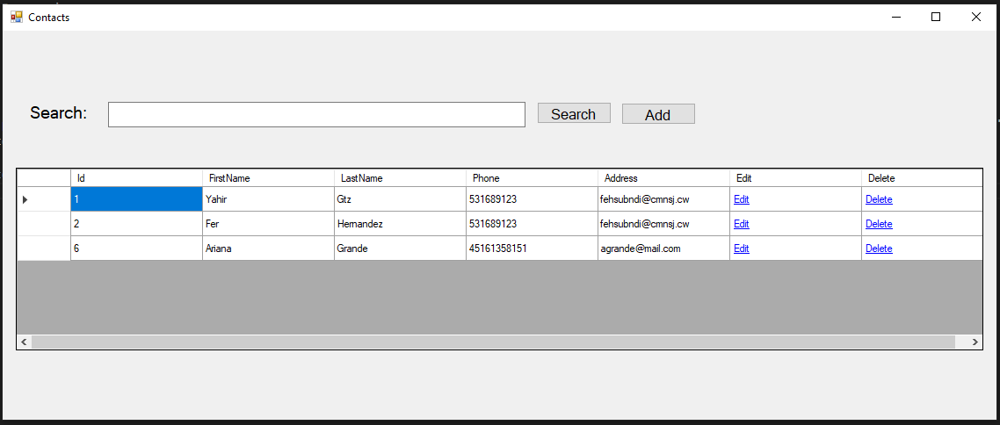
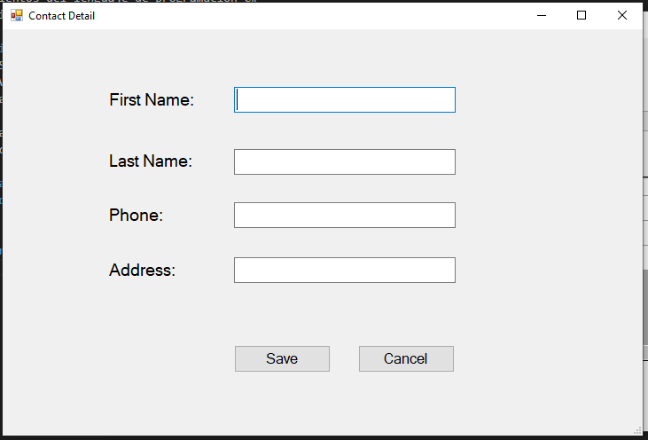
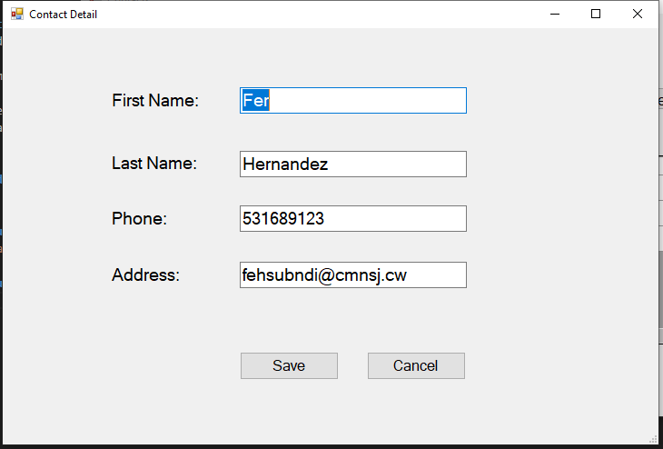
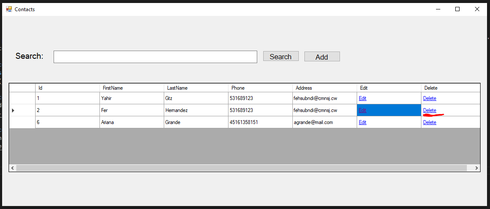
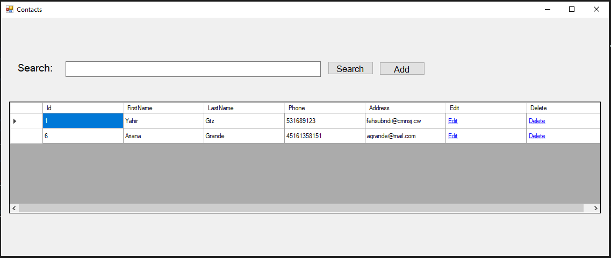

# Aplicación de WinForm con C#.NET de Contactos

## Requisitos:
- Conocimientos de base de datos y manipulación.
- Conocimientos del lenguaje de programación C#
- Conocimientos de .Net Framework

## Herramientas:
- Visual Studio
- SQL SERVER
- SQL Management Studio

Es importante saber que para que muchos de los elementos que se pueden llegar a mostrar se tienen que llegar a realizar primero poniendo los componentes como es un 'button', 'label', 'input', etc. Y asignar un nombre a cada uno de estos elementos, cambiando a sí también sus propiedades en el código fuentes de estas forms.cs.

## Tabla de Contactos en Base de Datos
También es importante destacar cómo esta desarrollada la tabla de la base de datos, así que su configuración es la siguiente:

## Resultado del proyecto
### Listado de contactos registrados

### Añadir nuevo contacto
Al presionar el botónn de "Add" se abre la ventana de añadir contacto

### Editar nuevo contacto
Al clickear en "Edit" en la parte de la tabla, ese registro se abre con los campos llenos de el usuario seleccionado

### Eliminar contacto

